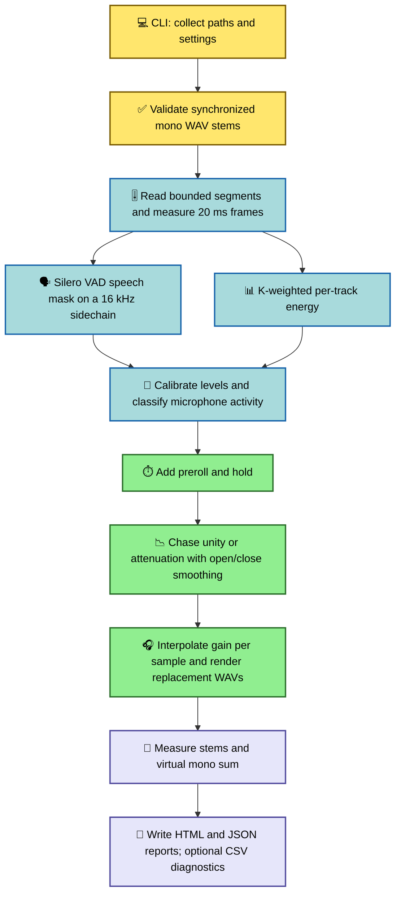

# Architecture and signal flow

Podcast Automixer is an offline, analysis-then-render pipeline. It does not mix the
microphones into one master file. It analyzes synchronized mono stems together, builds a
gain envelope for each stem, and writes one timing-identical replacement WAV per input.

## Processing workflow

## How activity detection works

Activity is not decided by a conventional noise gate or by VAD alone. The analyzer uses
two complementary signals for every microphone:

1. **Speech evidence.** Audio is resampled to a 16 kHz sidechain and passed to Silero VAD.
   Analysis is segmented for bounded memory use, with one second of context on either side
   so utterances crossing a segment boundary are handled consistently.
2. **Relative energy evidence.** The original-rate audio passes through an ITU-style
   K-weighting filter and is measured in 20 ms frames. This emphasizes perceptually
   relevant voice-band energy when microphones are compared.

The classifier calibrates stable speaker and microphone level differences using speech
frames, then finds microphones whose normalized energy is within the ownership ambiguity
range of the loudest track. If any VAD sees speech, plausible microphones remain active so
overlap and bleed are handled conservatively. A per-track 20th-percentile noise-floor
estimate also preserves plausible energetic human sounds that VAD missed when they rise
more than 12 dB above that floor.

The result is deliberately permissive: uncertain microphones tend to stay open instead of
risking an audible cut.

## Gain-envelope generation

Each active frame is expanded earlier by **preroll** and later by **hold**. The expanded
activity mask selects one of two targets per track:

- unity gain while active;
- the configured inactive attenuation while inactive (−6 dB by default).

A one-pole, continuously retargetable envelope chases those targets. Separate opening and
closing time constants let the gain recover quickly and attenuate more slowly. If activity
changes mid-transition, the envelope reverses smoothly from its current value. During
rendering, frame-rate gain values are linearly interpolated to sample positions before they
are multiplied into the audio.

Opening and closing controls are time constants rather than exact fade durations: one time
constant completes about 63% of a change, three complete about 95%, and five about 99%.

## End-to-end run lifecycle

The orchestration layer performs these stages in order:

1. Validate that there are at least two WAV-family files and that all inputs are mono with
   identical sample rate, frame count, and subtype.
2. Resolve a full-length or preview range and reserve output paths without silently
   overwriting existing files.
3. Analyze all stems together and create one gain envelope per stem.
4. Render through temporary files, preserve Broadcast Wave time-reference metadata when
   available, and atomically move completed WAVs into place.
5. Measure each rendered stem plus their unattenuated virtual mono sum using ITU-R BS.1770 /
   EBU R 128 loudness analysis.
6. Write the self-contained HTML report, JSON report, and optional frame-level diagnostics
   CSV. Newly created artifacts are cleaned up if the run fails or is cancelled.

## Module map

| Module | Responsibility |
| --- | --- |
| `cli.py` | Argument parsing, interactive prompts, progress display, and user-facing errors. |
| `run.py` | UI-independent orchestration through `RunRequest` and `RunResult`. |
| `core.py` | Input validation, VAD integration, K-weighted energy analysis, activity classification, and gain-envelope generation. |
| `filters.py` | Streaming K-weighting filter used by the analyzer and loudness meter. |
| `artifacts.py` | Safe output naming, chunked WAV rendering, temporary-file cleanup, and Broadcast Wave metadata preservation. |
| `loudness.py` | Streaming ITU-R BS.1770 / EBU R 128 measurements for rendered stems and the virtual mono program. |
| `report.py` | Shared report model and JSON, HTML, and CSV serialization. |
| `report-ui/src.tsx` | TypeScript/React source for the self-contained visual report, including attenuation and gain timelines. |

The separation between `cli.py` and `run.py` is the main seam for a future desktop or
browser-based interface: another front end can construct a `RunRequest`, receive progress
callbacks, and consume the same reports without reproducing the audio pipeline.

## Current controls

The public advanced controls are inactive attenuation, ownership ambiguity, and opening and
closing time constants. Internal defaults also define the analysis-frame size, preroll,
hold, and segment size. See `podcast-automix --help` for the currently supported CLI
surface; making more controls understandable, previewable, and reusable is part of the
[roadmap](../README.md#roadmap).
